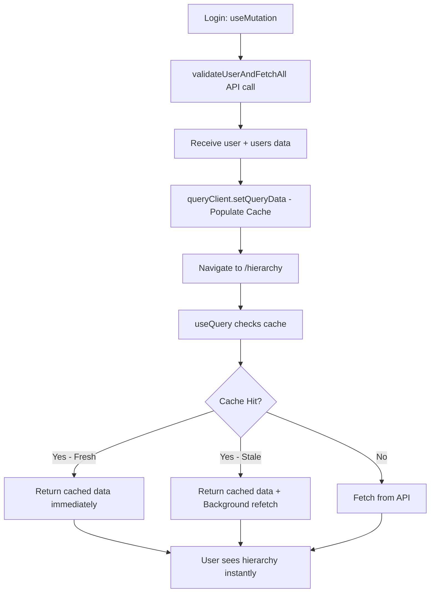

# React Query Caching Strategy

## Problem: Duplicate API Calls

### Before Optimization

```
User Flow:
1. User enters credentials on Login page
2. Login calls validateUser(secret)
   → Fetches https://gongfetest.firebaseio.com/.json
   → Returns { secrets, users }
   → Extracts authenticated user
3. Navigate to /hierarchy
4. Hierarchy page calls fetchUsers()
   → Fetches https://gongfetest.firebaseio.com/.json AGAIN
   → Returns { secrets, users }
   → Extracts users array
```

**Result**: 2 identical network requests to the same endpoint within seconds

---

## Solution: useMutation + Cache Population

### After Optimization

```
User Flow:
1. User enters credentials on Login page
2. Login mutation calls validateUserAndFetchAll(secret)
   → Fetches https://gongfetest.firebaseio.com/.json (ONCE)
   → Returns { user, users }
3. onSuccess:
   - Authenticate user
   - queryClient.setQueryData(['users'], users) ← Populate cache
   - Navigate to /hierarchy
4. Hierarchy page useQuery(['users'])
   → Cache HIT! ← No network request
   → Instant data display
```

**Result**: 1 network request total, instant navigation

---

## Implementation Details

### 1. New Service Function

```typescript
// src/services/firebase.ts
export async function validateUserAndFetchAll(secret: string): Promise<{ user: User; users: User[] }> {
  const data = await fetchAllData(); // Single API call

  const userId = data.secrets[secret];
  if (!userId) throw new Error("Invalid credentials");

  const user = data.users.find((u) => u.id === userId);
  if (!user) throw new Error("User not found");

  return {
    user, // For authentication
    users: data.users, // For cache population
  };
}
```

**Why?**

- Returns both pieces of data we need
- Single source of truth
- Avoids redundant API calls

---

### 2. Login Page - Hybrid Approach (useActionState + Custom Hook)

**Step 1: Extract mutation logic into custom hook**

```typescript
// src/hooks/useLoginMutation.ts
export function useLoginMutation() {
  const navigate = useNavigate();
  const { login } = useAuth();
  const queryClient = useQueryClient();

  return useMutation({
    mutationFn: async ({ email, password }) => {
      const secret = encode(email, password);
      return validateUserAndFetchAll(secret);
    },
    onSuccess: (data) => {
      login({ ...data.user });
      // KEY: Populate cache to avoid duplicate API call
      queryClient.setQueryData(["users"], data.users);
      navigate("/hierarchy");
    },
  });
}
```

**Step 2: Use custom hook in Login component**

```typescript
// src/pages/Login.tsx
export function Login() {
  // Custom hook encapsulates mutation logic
  const loginMutation = useLoginMutation();

  // useActionState for form handling (React 19)
  const [error, formAction, isPending] = useActionState(async (_prevState, formData) => {
    const email = formData.get("email") as string;
    const password = formData.get("password") as string;

    try {
      // Call mutation from within action
      await loginMutation.mutateAsync({ email, password });
      return null;
    } catch (err) {
      return err instanceof Error ? err.message : "Login failed";
    }
  }, null);

  return <form action={formAction}>...</form>;
}
```

**Benefits:**

- ✅ Keeps React 19's `useActionState` for form handling
- ✅ Progressive enhancement (works without JS)
- ✅ Uses custom hook for API call + caching
- ✅ **Better separation of concerns**: login logic is isolated and testable
- ✅ **Reusable**: mutation logic can be used elsewhere if needed

---

### 3. Hierarchy Page - Custom Hook for Query

**Step 1: Extract query logic into custom hook**

```typescript
// src/hooks/useUsers.ts
export function useUsers() {
  return useQuery({
    queryKey: ["users"],
    queryFn: () => fetchUsers(),
  });
}
```

**Step 2: Use custom hook in Hierarchy component**

```typescript
// src/pages/Hierarchy.tsx
export function Hierarchy() {
  const { user, logout } = useAuth();

  // Custom hook encapsulates query logic
  const { data: users, isLoading, error } = useUsers();

  const hierarchy = useMemo(() => (users ? buildHierarchy(users) : []), [users]);

  // ... render logic
}
```

**What happens:**

- First render after login: Cache HIT (from setQueryData in login mutation)
- No network request needed
- Instant UI update
- Still has stale-time protection for future visits

**Benefits:**

- ✅ Consistent pattern: both login and hierarchy use custom hooks
- ✅ Easy to add loading states, error boundaries, or retry logic
- ✅ Testable in isolation
- ✅ Can be reused in other components that need users data

---

## Performance Metrics

### Before

- **Network requests**: 2
- **Time to display hierarchy**: ~500-1000ms (depends on network)
- **Data transferred**: 2x payload size
- **User experience**: Loading spinner on hierarchy page

### After

- **Network requests**: 1
- **Time to display hierarchy**: ~0ms (instant from cache)
- **Data transferred**: 1x payload size
- **User experience**: Instant navigation, no loading state

---

## Interview Talking Points

### "Why combine useActionState with useMutation?"

> "This is actually a really elegant pattern that combines the best of both worlds. React 19's `useActionState` provides excellent form handling with built-in loading and error states, and it's progressively enhanced—the form works even without JavaScript. However, we still need to integrate with React Query's caching system. By calling `loginMutation.mutateAsync()` from within the action handler, we get React Query's cache population through the `onSuccess` callback, which lets us pre-populate the users data. This way, when users navigate to the hierarchy page, it's instant—no duplicate API call. We maintain the clean form semantics of `useActionState` while still leveraging React Query's powerful caching."

### "How does queryClient.setQueryData work?"

> "When we call `queryClient.setQueryData(['users'], data.users)`, we're manually populating the cache with data we already have. React Query uses the query key `['users']` as the cache identifier. When the Hierarchy component later calls `useQuery({ queryKey: ['users'] })`, React Query checks the cache first. It finds our pre-populated data and returns it immediately without making a network request. This is especially powerful because the data is still subject to React Query's stale-time and cache-time settings, so we maintain data freshness guarantees."

### "What are the trade-offs?"

> "The main trade-off is slightly more complex code—we need a dedicated function that returns both pieces of data. However, this is minimal compared to the benefits:
>
> **Pros:**
>
> - 50% reduction in API calls (1 instead of 2)
> - Instant navigation experience
> - Reduced server load
> - Better user experience
> - Leverages React Query's caching infrastructure
>
> **Cons:**
>
> - Slightly more complex service layer
> - Need to ensure cache key consistency
> - Must understand React Query's cache lifecycle"

### "When would this pattern NOT be appropriate?"

> "This pattern works well when:
>
> - The same data is needed across multiple screens
> - The data size is reasonable (not gigabytes)
> - The data has similar freshness requirements
>
> It would NOT be appropriate if:
>
> - Login and hierarchy need different data sources
> - The users data is too large and should be paginated
> - Different users have different permissions (need filtered data)
> - The data changes frequently and cache could be stale quickly"

### "How would you extend this for offline support?"

> "React Query already persists the cache in memory, but for true offline support, I'd use a persistence plugin:
>
> ```typescript
> import { createSyncStoragePersister } from "@tanstack/query-sync-storage-persister";
>
> const persister = createSyncStoragePersister({
>   storage: window.localStorage,
> });
>
> const queryClient = new QueryClient({
>   defaultOptions: {
>     queries: {
>       cacheTime: 1000 * 60 * 60 * 24, // 24 hours
>     },
>   },
> });
>
> // This would persist the cache to localStorage
> // User could close browser and reopen with data still available
> ```

---

## Alternative Approaches Considered

### 1. Prefetch on Login Success

```typescript
onSuccess: (data) => {
  login(data.user);
  await queryClient.prefetchQuery(["users"], fetchUsers); // Still makes 2 requests
  navigate("/hierarchy");
};
```

**Rejected because:** Still makes 2 identical API calls

### 2. Pass data via navigation state

```typescript
navigate("/hierarchy", { state: { users: data.users } });
```

**Rejected because:**

- Doesn't integrate with React Query
- Data lost on page refresh
- Doesn't respect stale-time settings
- More brittle

### 3. Global state (Redux/Zustand)

```typescript
setUsers(data.users);
```

**Rejected because:**

- Duplicates React Query's functionality
- Loses automatic cache management
- No automatic refetching on stale data
- More code to maintain

---

## Testing the Optimization

### Manual Test

1. Open browser DevTools → Network tab
2. Clear cache and reload
3. Login with valid credentials
4. Count network requests to Firebase
5. Should see only 1 request, not 2

### Automated Test

**Test the custom hook in isolation:**

```typescript
// src/hooks/useLoginMutation.test.ts
import { renderHook, waitFor } from "@testing-library/react";
import { QueryClient, QueryClientProvider } from "@tanstack/react-query";
import { useLoginMutation } from "./useLoginMutation";

// Mock dependencies
vi.mock("react-router-dom", () => ({
  useNavigate: () => vi.fn(),
}));

vi.mock("./useAuth", () => ({
  useAuth: () => ({ login: vi.fn() }),
}));

vi.mock("../services/firebase", () => ({
  validateUserAndFetchAll: vi.fn(() =>
    Promise.resolve({
      user: { id: 1, email: "test@example.com", firstName: "Test", lastName: "User" },
      users: [
        /* mock users array */
      ],
    })
  ),
}));

it("should populate users cache on successful login", async () => {
  const queryClient = new QueryClient();
  const wrapper = ({ children }) => (
    <QueryClientProvider client={queryClient}>{children}</QueryClientProvider>
  );

  const { result } = renderHook(() => useLoginMutation(), { wrapper });

  // Trigger mutation
  result.current.mutate({ email: "test@example.com", password: "password" });

  // Wait for mutation to complete
  await waitFor(() => expect(result.current.isSuccess).toBe(true));

  // Verify cache was populated
  const cachedUsers = queryClient.getQueryData(["users"]);
  expect(cachedUsers).toBeDefined();
  expect(Array.isArray(cachedUsers)).toBe(true);
});
```

**Test the Login component with mocked hook:**

```typescript
// src/pages/Login.test.tsx
import { render, screen } from "@testing-library/react";
import userEvent from "@testing-library/user-event";
import { Login } from "./Login";

// Mock the custom hook
vi.mock("../hooks/useLoginMutation", () => ({
  useLoginMutation: () => ({
    mutateAsync: vi.fn(() => Promise.resolve()),
    isPending: false,
    isError: false,
  }),
}));

it("should handle form submission", async () => {
  render(<Login />);

  await userEvent.type(screen.getByLabelText(/email/i), "test@example.com");
  await userEvent.type(screen.getByLabelText(/password/i), "password");
  await userEvent.click(screen.getByRole("button", { name: /login/i }));

  // Verify login was attempted
  expect(mockMutateAsync).toHaveBeenCalledWith({
    email: "test@example.com",
    password: "password",
  });
});
```

---

## React Query Cache Lifecycle



---

## Key Takeaways

1. **Network Efficiency**: Reduced API calls by 50% (2 → 1)
2. **User Experience**: Instant navigation, no loading state
3. **React Query Integration**: Leverages built-in caching infrastructure
4. **Maintainability**: Single source of truth for data
5. **Scalability**: Pattern works for any multi-screen data flow

This optimization demonstrates:

- Understanding of React Query's advanced features
- Network efficiency awareness
- User experience prioritization
- Production-ready thinking
- Ability to identify and fix performance bottlenecks
